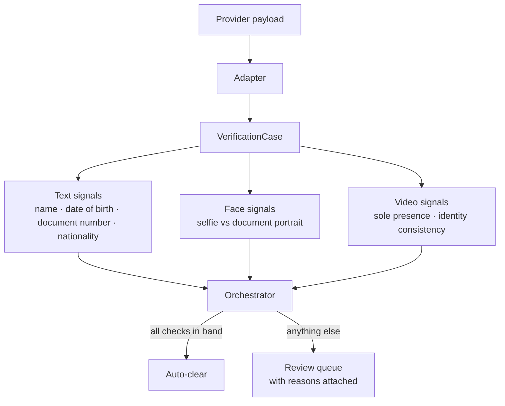

# Automated KYC Verification System

**A reference implementation of an identity-verification pipeline that clears straightforward cases automatically and escalates the rest to human reviewers, with the reasons attached.**

Runs on synthetic data, on the standard library alone. Clone it and `make demo`.

---

## What this repository is

Identity verification usually starts out manual. A customer submits their registered details, a photograph of an identity document, a selfie, and — depending on the provider — a recorded video. Somebody then opens each case and answers two questions:

1. **Do the details agree?** Does the name on the form match the name on the document, allowing for transliteration, particles, middle names, honorifics and ordering? Do the date of birth and document number agree, allowing for how often a zero is read as the letter O?
2. **Is this the right person, on their own?** Is the face in the selfie the face on the document, and in the video, is that same person present throughout without someone else stepping in to help?

The first question is a text problem. The second is a vision problem. Both are answerable well enough that reviewers should only see the cases that genuinely need judgement — which is what this pipeline does.

I led this work in 2025 and built a large part of it, together with my team and the operations team whose review workflow it changed.

## What this repository is not

This is a **clean-room reimplementation written from scratch for a portfolio**. It is not the production system, and it deliberately omits the things that would make it one:

- **No production code**, configuration, or infrastructure.
- **No trained weights.** The vision interfaces are real; the model behind them is yours to supply.
- **No calibrated thresholds.** The numbers in `policy.py` are placeholders chosen to make the demo readable. Publishing the real bands of a fraud control would be publishing instructions for staying just underneath them.
- **No detection heuristics** beyond what the problem statement itself implies.
- **No provider names**, payload formats, or vendor-specific behaviour.
- **No real data.** Every case in `data/synthetic/` is invented.

See [docs/scope-and-exclusions.md](docs/scope-and-exclusions.md) for the full list and the reasoning.

## How it works



**Text signals** normalise both names before comparing them — accents stripped, honorifics and naming particles dropped, transliteration variants folded together — then score what remains. A name written `Md. Kamal Hossain` on a form and `Mohammad Kamal Hosain` on a passport is the same name, and a pipeline that cannot see that sends thousands of legitimate customers to a queue.

**Face signals** compare embeddings: the selfie against the portrait on the document, and sampled video frames against that same portrait. The video check reports the *weakest* frame rather than the average, because an average hides the few seconds where somebody else appears.

**The orchestrator** applies routing bands and produces one of two outcomes: cleared, or escalated with reasons. It never declines anyone. See [decision 0002](docs/decisions/0002-clear-or-escalate-never-auto-decline.md).

## Run it

```bash
git clone https://github.com/nadim-raj/automated-kyc-verification-system
cd automated-kyc-verification-system
make demo     # run the pipeline over the synthetic cases
make test     # 43 tests, no dependencies
```

No virtualenv, no install step: the pipeline runs on the Python standard library. PyTorch, spaCy and RapidFuzz are optional extras that swap the synthetic implementations for real models (`pip install -e '.[ml]'`).

```
case                           provider        outcome     why
clean_video_match              video_capable   auto_clear  all checks within the auto-clear band
transliteration_variant        video_capable   auto_clear  all checks within the auto-clear band
name_order_swapped             video_capable   auto_clear  all checks within the auto-clear band
middle_name_missing            video_capable   auto_clear  all checks within the auto-clear band
dob_day_month_transposed       video_capable   review      dob_match scored 0.50 against 1.00 (day and month appear transp...
document_number_ocr_confusion  video_capable   auto_clear  all checks within the auto-clear band
second_person_in_frame         video_capable   review      sole_presence scored 0.40 against 0.95 (4/10 frames show one fa...
different_person_in_video      video_capable   review      video_consistency scored 0.00 against 0.70 (weakest of 10 frame...
video_expected_but_absent      video_capable   review      this provider supplies video, but none was attached to the case
data_only_clean                data_only       auto_clear  all checks within the auto-clear band
data_only_name_mismatch        data_only       review      name_match scored 0.47 against 0.93 (fuzzy similarity)

6 of 11 cases cleared without a reviewer; 5 escalated.
```

## Layout

| Path | What lives there |
|---|---|
| `kyc_pipeline/domain.py` | Provider-agnostic types every stage shares |
| `kyc_pipeline/normalize.py` | Accents, honorifics, particles, transliteration, confusable glyphs |
| `kyc_pipeline/matching.py` | Scored text comparisons, each returning a signal |
| `kyc_pipeline/ner.py` | Person-name extraction: spaCy when available, heuristic otherwise |
| `kyc_pipeline/face/` | Embedding interface, synthetic and PyTorch adapters, presence counting |
| `kyc_pipeline/video/` | Frame sampling behind a source interface |
| `kyc_pipeline/policy.py` | Routing bands (illustrative placeholders) |
| `kyc_pipeline/orchestrator.py` | Signals in, routing decision out |
| `kyc_pipeline/review.py` | The packet a reviewer receives; redacted records for logs |
| `kyc_pipeline/pii.py` | Masking and salted pseudonymisation |
| `kyc_pipeline/synthetic.py` | Fixture generator covering every scenario |
| `docs/` | Architecture, decision records, evaluation, privacy, scope |

## Documentation

- [Architecture](docs/architecture.md) — components, data flow, and the interfaces that keep models swappable
- [Evaluation](docs/evaluation.md) — how to tell whether a change helped, without shipping a regression to real customers
- [Privacy](docs/privacy.md) — data minimisation, redaction, retention, and access
- [Scope and exclusions](docs/scope-and-exclusions.md) — what is deliberately missing and why
- Decision records:
  - [0001 — Separate text and vision signals](docs/decisions/0001-separate-text-and-vision-signals.md)
  - [0002 — Clear or escalate, never auto-decline](docs/decisions/0002-clear-or-escalate-never-auto-decline.md)
  - [0003 — Providers that supply no video](docs/decisions/0003-providers-without-video.md)
  - [0004 — Clean room and synthetic data](docs/decisions/0004-clean-room-and-synthetic-data.md)
  - [0005 — Heavy dependencies stay optional](docs/decisions/0005-optional-model-dependencies.md)

## Licence

MIT. See [LICENSE](LICENSE).
