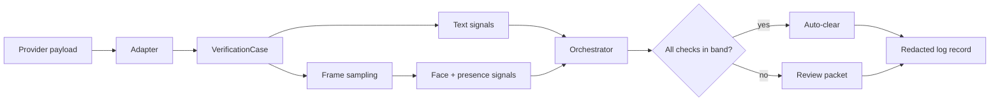

# Architecture

The pipeline turns a provider payload into one routing decision, and explains itself on the way.

## Stages

| Stage | Module | Responsibility |
|---|---|---|
| Adapt | `providers.py` | Translate a vendor payload into domain types. Nothing downstream knows which vendor a case came from. |
| Compare text | `matching.py`, `normalize.py` | Score name, date of birth, document number, and nationality. |
| Compare faces | `face/` | Score the selfie against the document portrait, and video frames against that portrait. |
| Check presence | `face/presence.py` | Report how consistently exactly one face appears across sampled frames. |
| Route | `orchestrator.py`, `policy.py` | Apply routing bands; clear or escalate with reasons. |
| Hand over | `review.py`, `pii.py` | Build the reviewer packet; emit a redacted record for logs and metrics. |

## Flow

## Signals, not a single score

Every comparison returns a `Signal` carrying a score, whether it was **available**, and a sentence of explanation. Three properties follow:

- **A missing check is not a failing check.** A case with no video is different from a case whose video looks wrong, and the two deserve different handling. Collapsing them into one number loses that.
- **Reasons come for free.** The orchestrator lists the checks that fell outside their band, so the review queue arrives pre-explained.
- **Signals are tuned independently.** Names and faces fail for unrelated reasons; a single blended score makes every adjustment a negotiation with every other check.

## Interfaces

Four seams keep the models swappable. Each has a synthetic implementation for demos and tests, and a real adapter you supply.

| Protocol | Synthetic | Real |
|---|---|---|
| `FaceEmbedder` | `SyntheticEmbedder` — deterministic vectors from fixture seeds | `TorchFaceEmbedder` — your backbone and preprocessing |
| `FaceCounter` | `SyntheticFaceCounter` — reads the fixture's face list | A detector of your choosing |
| `FrameSource` | `PrefetchedFrameSource` — frames the fixture supplies | `OpenCVFrameSource` — decode a real file |
| `NameExtractor` | `HeuristicNameExtractor` — capitalised runs | `SpacyNameExtractor` — `PERSON` entities |

The pipeline depends on the protocols, never the implementations, which is why the whole thing runs and is testable without a model present.

## Frame sampling

Scoring every frame of a recording costs a lot and buys little; neighbouring frames are nearly identical. Sampling evenly across the clip keeps cost flat regardless of length and covers the whole recording rather than its opening seconds — which matters, because the interesting moments in a verification video are rarely at the start.

## Where it breaks

Known limits, stated plainly because a reference implementation that pretends to be complete is worse than one that does not:

- **Normalisation is market-specific.** The equivalence groups in `normalize.py` cover a handful of conventions. A deployment in a new market needs its own list, maintained by people who know the naming conventions.
- **Presence counting is coarse.** It answers "how often was exactly one face visible", nothing more.
- **Document authenticity is out of scope.** Whether the document itself is genuine is a separate problem, usually answered by the provider.
- **The synthetic embedder is not a face model.** It exists so the architecture can be demonstrated without real images.
